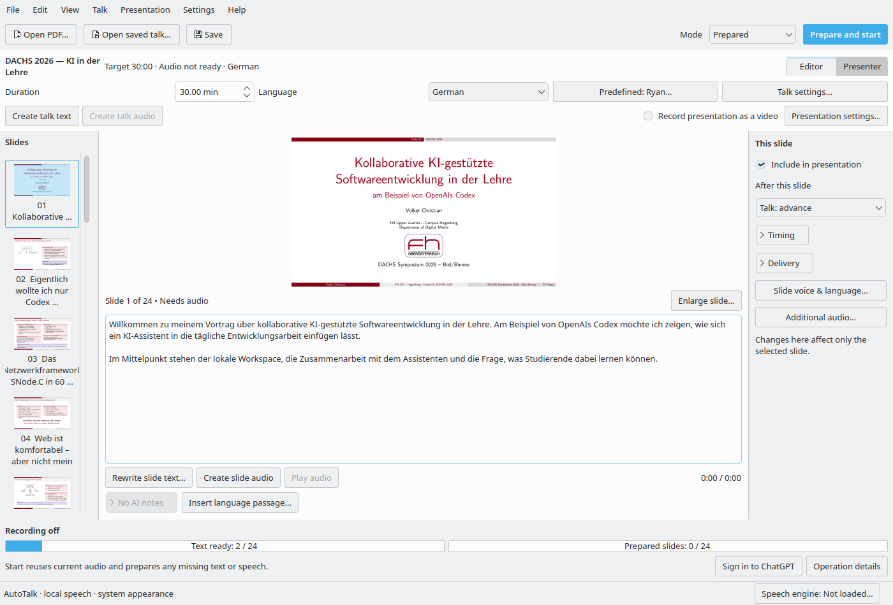
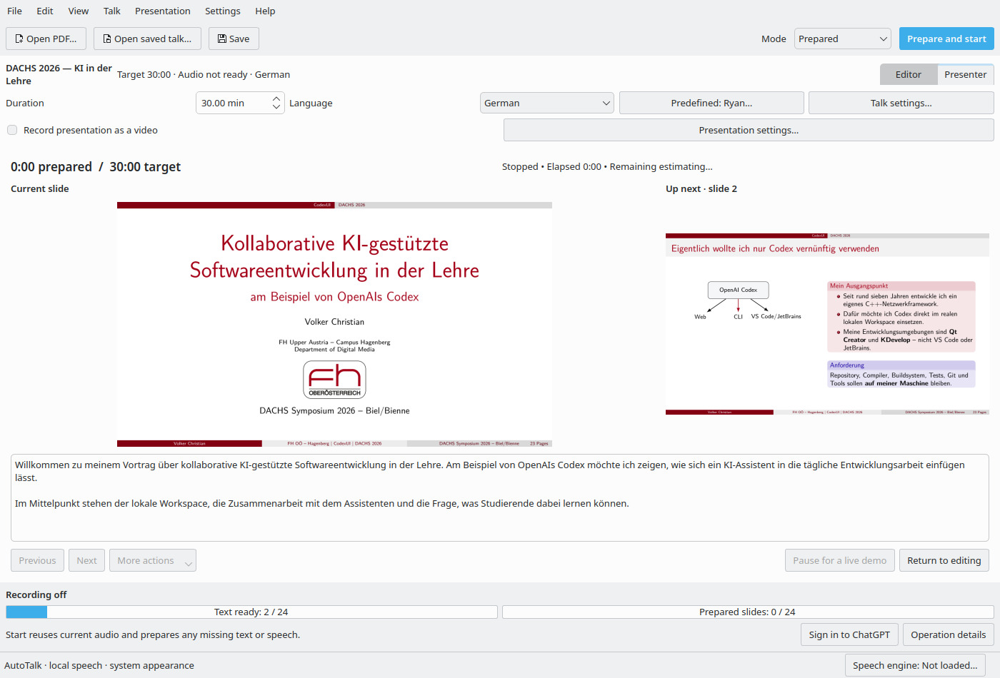

# AutoTalk

**Turn PDF slides into a timed, spoken presentation.**

AutoTalk is a Qt desktop application for preparing and presenting slide decks with
AI-generated narration and local speech synthesis. Choose a PDF, a language and a
target duration; add audience or conference context, select a voice, and review
or present the resulting talk.

Narration is written through **Codex app-server** using your ChatGPT sign-in.
**Qwen3-TTS 1.7B** generates speech locally. The interface is built with Python
and PySide6 and follows the platform's appearance.

**Status:** development prototype, version 0.3. Linux is the primary tested
platform. Windows and macOS implementations are available for development but
still require native qualification. There is no stable release yet.



*Linux editor with Volker Christian's DACHS 2026 presentation,
“Kollaborative KI-gestützte Softwareentwicklung in der Lehre,” and example narration.*

## What you can do

- Tailor narration to an audience, conference website or written conference scope.
- Edit narration and generate or preview audio for individual slides or a whole talk.
- Use predefined voices, a recording of your own voice, or a designed voice.
- Prepare talks in ten languages and retain separate language versions.
- Present fullscreen with synchronized slide advancement, pause/resume and live demos.
- Export slides and narration as video or audio; record the desktop and system audio on Linux.
- Save projects, reuse matching generated audio and control when speech models occupy GPU memory.

## Three ways to present

| Mode | Workflow |
| --- | --- |
| **Prepared** | Review text and audio at your own pace. **Prepare and start** completes missing content before presenting. |
| **Quick** | Choose a PDF, language and duration, then **Start**. Uses the configured voice and model settings without conference setup. |
| **Realtime** | **Start** prepares an opening audio buffer, then continues preparing later slides during the presentation. |

Realtime is generated narration, not an audience conversation. Startup time
includes any required model loading; slower synthesis can cause buffering.
Target duration is approximate until audio has been generated and measured.



*Presenter view: current and next slides, narration, timing and playback controls.*

## Requirements and platform support

| Platform | Speech backend | Validation status |
| --- | --- | --- |
| Linux x86_64 with NVIDIA GPU | vLLM-Omni streaming | Tested locally on an RTX 2000 Ada laptop with 8 GB VRAM |
| Windows 11 x64 with NVIDIA GPU | Qwen / PyTorch CUDA | Native testing pending |
| macOS 14+ on Apple Silicon | MLX Audio / Metal | Native testing pending |

Speech generation requires a supported GPU and compatible operating-system
drivers. CPU/NPU inference and Intel Macs are outside the current prototype.
Playback of already prepared audio does not require the speech model or a
synthesis-capable GPU.

First-time speech setup downloads a private runtime and model files automatically.
Internet access and several GB of downloads are required; allow approximately
**40 GB of free space on Linux** for the runtime, models and installation caches.
Subsequent use reuses cached files.

Narration generation requires an eligible ChatGPT sign-in through Codex and is
subject to account usage limits. Slide images, extracted text and supplied context
are sent to Codex. Voice references and speech synthesis remain local.

## Get started

Until a stable release is published, run from source or use a development artifact
from a successful [native build](https://github.com/SNodeC/AutoTalk/actions/workflows/native-builds.yml).
GitHub artifact downloads require sign-in; these builds are not qualified releases.

For a source installation on Linux or macOS, use **Python 3.12–3.14**:

```sh
git clone https://github.com/SNodeC/AutoTalk.git
cd AutoTalk
python3 -m venv .venv
.venv/bin/python -m pip install -e .
.venv/bin/autotalk
```

On Windows, create the environment with `py -3.12 -m venv .venv`, then use
`.venv\Scripts\python.exe -m pip install -e .` and `.venv\Scripts\autotalk.exe`.
Linux Qt runtime packages and native packaging instructions are covered in the
[build guide](docs/BUILDING.md).

1. Select **Open PDF…** and choose your slide deck.
2. Set the duration and language; optionally choose a voice and conference context.
3. Select a mode. Review individual slides in Prepared mode, or choose **Start**
   in Quick or Realtime.
4. Enable recording before presenting if you want to save the live session.
   For desktop recording, use **End presentation and save video** to finish it.

Projects are saved in an `autotalk` subfolder beside the imported PDF. Use
**Open saved talk…** to return to a project.

## Documentation and development

- [User guide](docs/USER_GUIDE.md): preparation, voices, settings, presentation and recording.
- [Building and testing](docs/BUILDING.md): source setup, native packages, Qt dependencies and architecture.
- [Roadmap](docs/ROADMAP.md): planned work and remaining qualification.
- [Verification record](docs/VERIFICATION.md): dated engineering checks and limitations.
- [Issue tracker](https://github.com/SNodeC/AutoTalk/issues): report problems with the OS,
  AutoTalk/Qt versions, reproduction steps and relevant operation logs.

Review wording, pronunciation, timing and recording behavior before using a talk
at an event. Automated builds do not establish GPU compatibility on every machine.

## License

A license for AutoTalk's own code has **not yet been selected**. Public repository
access does not grant an open-source license. Dependencies and model weights
retain their respective licenses; see [third-party notices](THIRD_PARTY.md).
