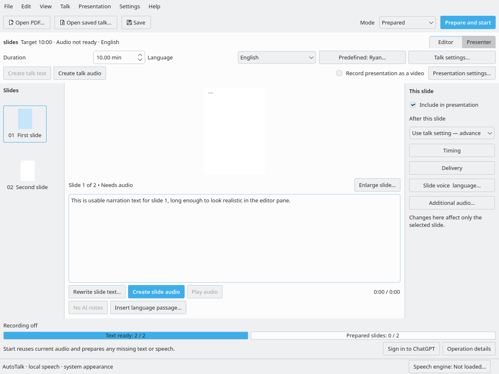

# Claude review provenance and evidence

The owner explicitly requested an independent review through the installed,
authenticated Claude CLI, a new pushed GitHub branch, and a repository record of
Claude's verdict. Codex prepared the snapshot and brief, relayed evidence checks,
and recorded the output. Claude authored the verdict. This was an informed review:
Claude saw the owner's complaints, requirements and the existing implementation
reports; it was not a blinded usability study.

## Snapshot and reviewer

- Review branch: [review/claude-ui-ux-2026-09-27](https://github.com/SNodeC/AutoTalk/tree/review/claude-ui-ux-2026-09-27).
- Reviewed source: [8d06f96910ad9a00c0372dd29b69b93cf522e354](https://github.com/SNodeC/AutoTalk/commit/8d06f96910ad9a00c0372dd29b69b93cf522e354).
- Claude Code CLI version: **2.1.276**.
- Model reported by the CLI: **claude-sonnet-5** (the CLI default; no model override).
- The branch was pushed before the review. Claude received both the GitHub link
  and access to the matching local checkout.
- [Final verdict](2026-09-27-claude-verdict.md): Claude's final response, preserved
  verbatim. Recommendations are the reviewer's assessment, not approved changes.

## Instructions and review process

The [initial brief](2026-09-27-claude-review-brief.md) records product requirements,
all five review areas, reported defects and engineering constraints. Local session
instructions also supplied the three user screenshots, generated screenshots,
source/test paths and the native Qt/Xvfb test command. User screenshots containing
slide content were supplied locally to Claude and are not included in this commit.

Claude ran with safe mode, noninteractive output and explicitly allowed
Read/Glob/Grep/Bash tools. Production edits, git mutations, credentials access and
additional external communications were excluded. Synthetic probes were allowed
under `/tmp/autotalk-claude-review`; GPU model downloads and live GPU/Codex jobs
were excluded to avoid interfering with the user's running environment.

Codex checked the initial report's coverage and several factual assertions. The
[evidence follow-up](2026-09-27-claude-review-followup.md) requested corrections,
additional visual checks and a fuller placement table. The final
[consolidation request](2026-09-27-claude-review-consolidation.md) requested one
self-contained report and clarified evidence versus design judgment. These
follow-ups came from Codex; they are not additional instructions from the owner.
The final verdict must be read with that distinction where it discusses preferences.

## Verification actually performed

Claude ran the native Qt/Breeze Linux suite under Xvfb:

```sh
PYTHONPATH="$PWD/artifacts/ux-placement/package-source/build/system-qt:$PWD/src" LD_LIBRARY_PATH="$PWD/artifacts/ux-placement/package-source/build/system-qt/PySide6/Qt/lib" QT_QPA_PLATFORM=xcb xvfb-run -a .venv/bin/pytest -q
```

Result: **325 passed in 59.09 seconds**. The staged native Qt tree is a local build
artifact, so reproducing this exact command elsewhere requires that matching build
setup; it is not a portable installation command.

Additional diagnostic probes used synthetic projects and the real UI/playback
classes. They were not added to the application's regression suite:

| Probe | Recorded outcome |
| --- | --- |
| Trivial job without a project-update callback | Did not reproduce disabled settings; the probe's hypothesis assertion failed. |
| Active-result callback | Initial artificial playback setup caused Qt errors; a corrected controlled setup reproduced disabled fields. |
| Ordinary project adoption after a job | Reproduced disabled settings; revisiting the page restored them. |
| Read conference website | Reproduced the reported pattern through `read_conference()`, replacing only network/Codex extraction with a deterministic result. |
| Stop a synthetic recorded presentation | Observed authoring locked during video export and restored afterward. |
| Click Start during that export | Produced partial observations but timed out; not a clean end-to-end passing test. |
| Render an editor with narration | Confirmed both Start and Create slide audio visible/enabled with primary styling. |



The screenshot contains a synthetic test deck, not the user's slide content.
Claude also inspected provided and previously generated screenshots and skimmed
the interactive prototype. This was not exhaustive live interaction with every
screen/menu or a study with recruited ordinary users. Placement assessments and
click-cost estimates are reviewer judgments, not measured user-study results.

## Limits and accounting

No new live GPU/Codex startup benchmark, terminal SIGINT integration test,
Wayland capture/device-stall test, or Windows/macOS execution was performed.
Historical two-slide timings do not establish current 24-slide startup performance
or attainment of the 15–20-second target. Reported repeated unloading and permanent
post-stop lockup remain distinct from the narrower behaviors reproduced here.

Review activity changed **0 production lines and 0 application test lines**.
The first branch commit snapshots work already present before this review; the
following review commit adds documentation and synthetic visual evidence only.
Raw CLI transcripts, intermediate report drafts and diagnostic output remain local
under ignored `artifacts/claude-review/` rather than publishing private screenshot
payloads. No application fixes were implemented as part of this review.

## Reading the verdict

The verdict preserves the reviewer's wording; it is not a certification that every
claim or placement is correct. In particular, navigation costs in the placement
table are estimates, not measured routes: choosing a non-default voice tab adds
an activation after opening the dialog, and the engine shortcut may scroll past
other controls on the same page. The current authoring controls are mode-dependent,
so broad statements about being always visible must be read in their editor context.
The preserved screenshot supports the visual observation of two primary actions;
calling that confusing remains a design judgment. The required three-dialog
settings decision remains the owner's requirement regardless of reviewer opinion.

The final report's “working tree clean throughout” describes the reviewed source;
Codex subsequently added these review documents and evidence, without changing
production code. The report also describes signal/GPU tests as unsupported by its
tools; more precisely, they were not performed under the session scope described
above. The available shell did not establish a technical impossibility.

Final verdict SHA-256: `bd2c273685573dc43db1e02c3382a5eb786320a1ac6537febd2e9932cbdc1ea2`.
